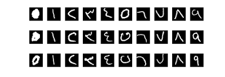
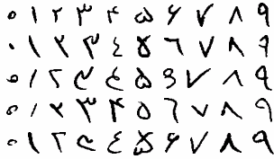

# Arabic or Farsi? 
### *ML algorithm that recognizes whether the writer is an Arabic or Farsi speaker.*

Arabic Digits (Image from Google Images)

Farsi Digits (Image from https://github.com/amir-saniyan/HodaDatasetReader)

